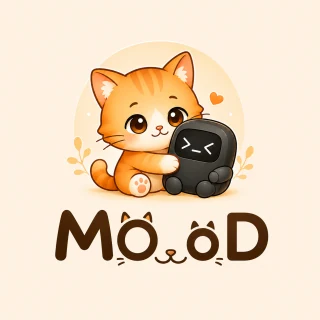
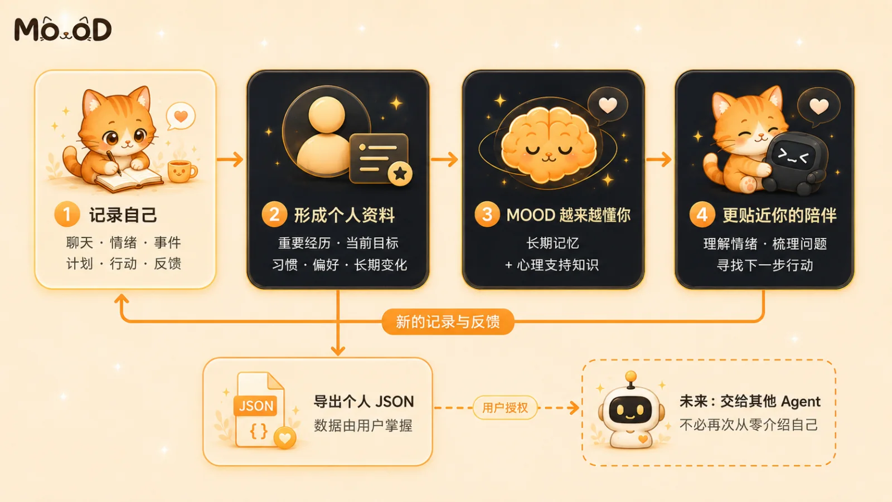
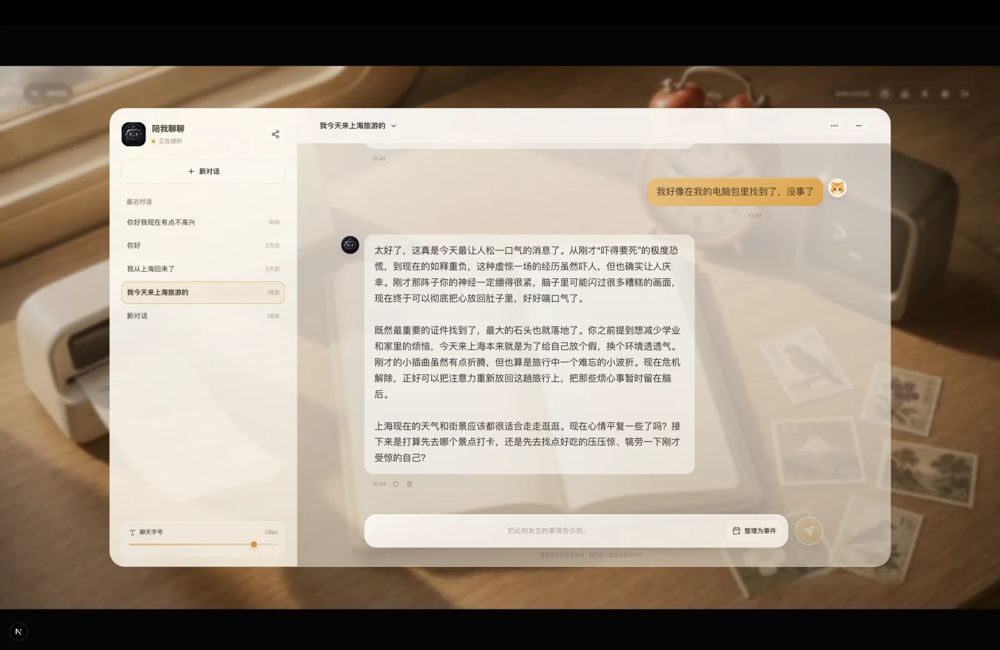
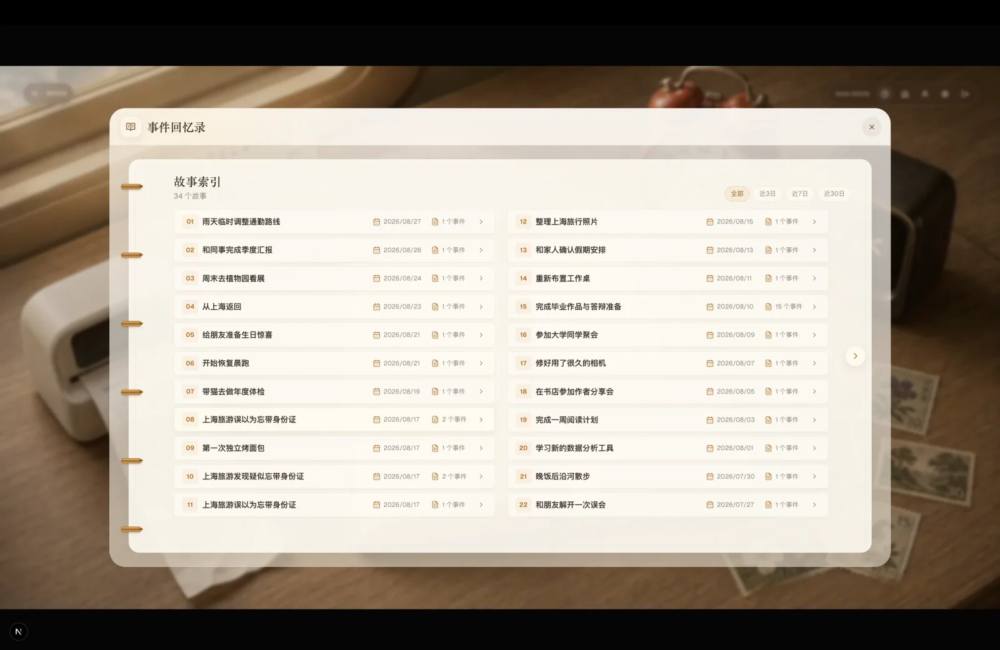
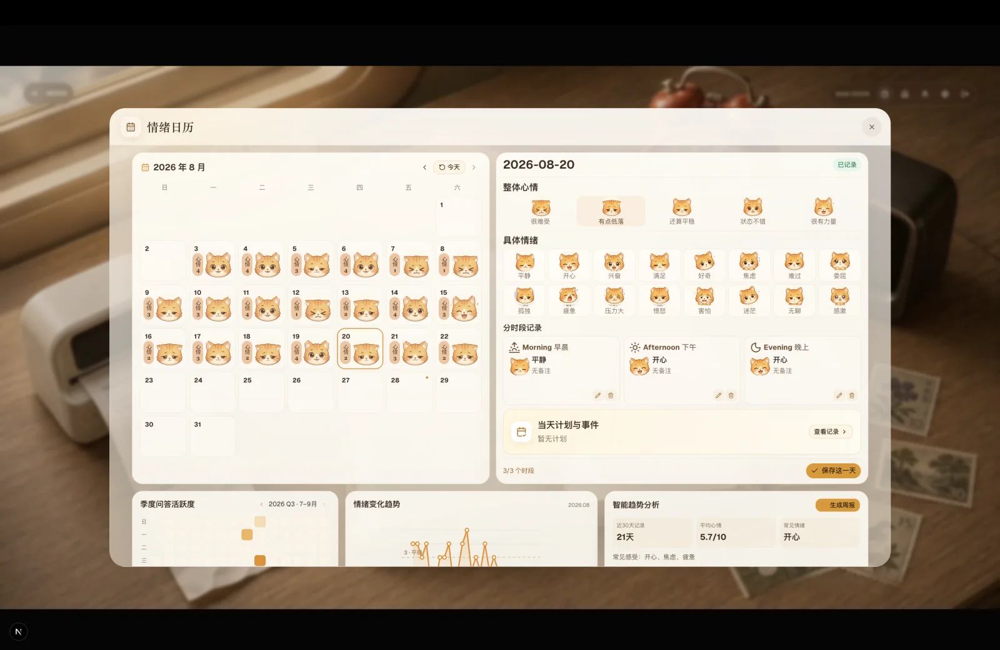
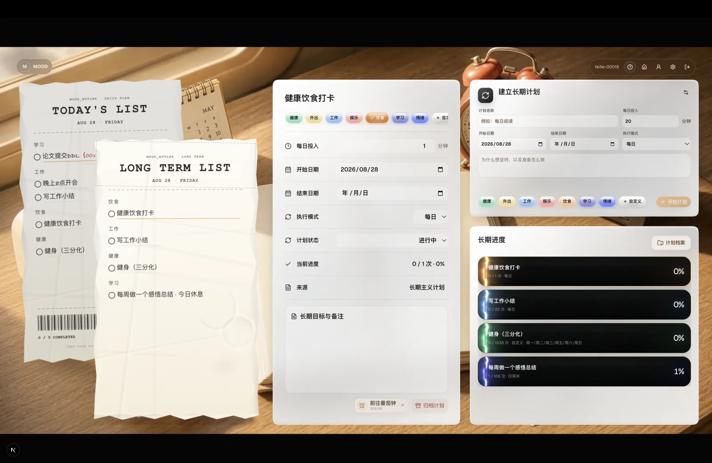
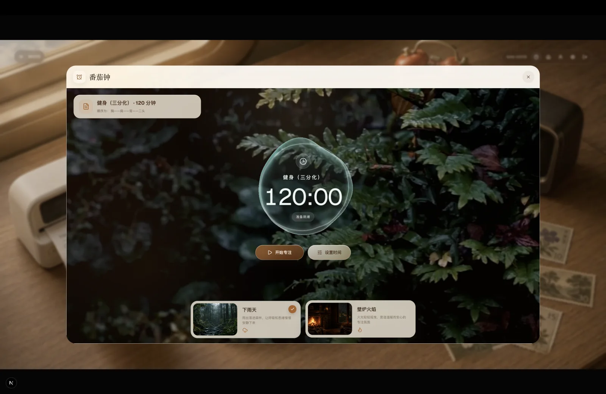
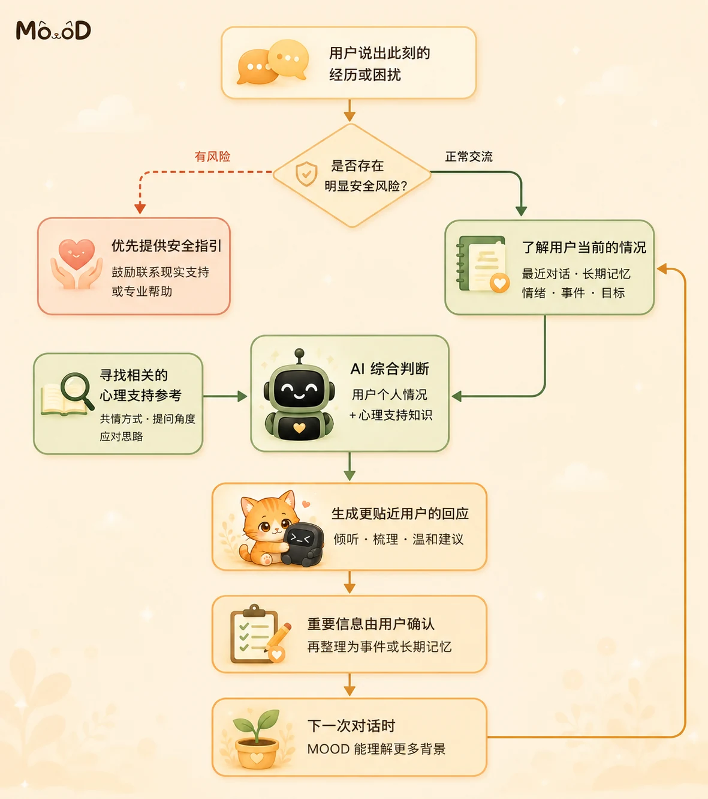
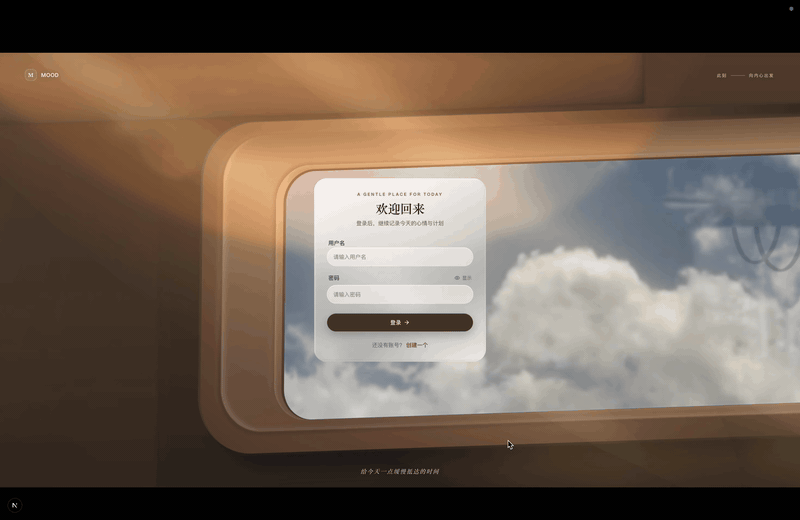

  
  <h1>MOOD</h1>
  
<strong>A place to record your life—and help AI understand you over time.</strong>

  
A desktop app that connects conversations, emotions, experiences, plans, and everyday memories.

  
<a href="README.md">简体中文</a> · <a href="README_EN.md">English</a>

  
<code>v1.0.0 Beta</code> · Windows x64 · macOS Apple Silicon

  
<a href="../../releases/latest/download/MOOD-1.0.0-Beta-x64-Setup.exe">Download for Windows</a> · <a href="../../releases/latest/download/MOOD-1.0.0-arm64.dmg">Download for macOS</a> · <a href="../../releases/latest">View the latest release</a>

## What is MOOD trying to do?

Life leaves us with all kinds of moments: an argument, a low day, a sudden thought, or the relief of finally finishing something we had put off for weeks. Those moments often end up scattered across chats, calendars, and to-do lists, then become difficult to find again.

MOOD is designed to connect those pieces. You can record what is happening, receive gentle everyday emotional support when you need it, and turn meaningful experiences into events, stories, and actions. Records you confirm can become long-term context, so future conversations do not have to begin from zero.

In the longer term, that context should not belong to one model or one app. MOOD can already export your profile, conversations, events, emotions, and plans as JSON. Our future goal is to turn selected, user-approved parts of that archive into portable personal context that you can share with other agents.

_The diagram is in Chinese because MOOD's current interface is Chinese. It shows four stages: record yourself, form a personal profile, help MOOD understand you over time, and receive more relevant companionship—with user-owned JSON as the bridge to future agents._

## How do the features work together?

MOOD is not a chat box, a calendar, and a to-do list placed next to one another. Each part can naturally lead into the next.

### 1. Begin with a conversation

Start by sharing what happened today—or simply say, “I am having a difficult moment.” MOOD first tries to understand whether you want to be heard, make sense of the situation, or take one small next step.

When a conversation contains an experience worth keeping, MOOD asks whether you want to organize it. It does not quietly turn an interpretation into a fact.

### 2. Turn meaningful experiences into stories

Once you confirm an event, its people, time, facts, thoughts, emotions, and possible needs can stay together for later review.

Related events gradually form a story. Instead of searching through isolated chat messages, you can return to a chapter of life you actually lived through.

### 3. Notice how your emotions change

The emotion calendar places mood, stress, sleep, and triggers on a timeline. It is not there to grade you. It helps you notice what has been affecting you, when you tend to feel drained, and which patterns may be changing.

### 4. Turn reflection into action

After talking something through, a next step can become a daily or long-term plan. A plan can then move into the focus timer and become time you have actually set aside.

MOOD also keeps the outcome and your feedback. When a similar situation comes up later, it can remember not only what you planned to do, but which approaches genuinely worked for you.

### 5. Keep the moments worth celebrating

Life is not only a list of problems to solve. Finishing something, visiting a place, or noticing a moment you want to remember can become a stamp—a small record and a small reward for showing up in your own life.

> Conversation → Events and stories → Emotions → Plans → Focus → Feedback → Better context next time

## How does MOOD shape a response?

From a user's perspective, the process is simple. MOOD first checks for an immediate safety concern. Within the permissions you choose, it can then consider recent conversations, confirmed experiences, emotions, and goals, alongside relevant examples of supportive conversations, before composing a response that better fits the moment.

If a message suggests an immediate risk to someone's safety, MOOD prioritizes safety guidance and encourages the user to contact a trusted person, local emergency services, or professional support instead of continuing with an ordinary chat.

_In the diagram: MOOD checks for safety risk, reviews the user's permitted context, looks for relevant emotional-support references, and combines them into a response. Important information still requires the user's confirmation before becoming an event or long-term memory._

There is an important boundary here: an older story can only be offered as a possible connection. You can confirm, edit, disable, or delete memories instead of having the app state uncertain associations as facts.

## Your records belong to you

The current version can export a compact JSON file containing:

- Your profile and preferences
- Useful conversations and summaries
- Confirmed events and stories
- Emotion records
- Tasks, daily plans, and long-term plans

The export does not include stamp images, system logs, account credentials, or AI configuration. Treat the file as private personal data and store it carefully.

**Available today:** you can export these structured records in full, giving you a copy you control when changing devices or organizing your personal archive.

**Our future direction:** generate a smaller, selectable, user-approved Agent Context Pack from that archive. You could share it with a learning, work, health, or general-purpose agent so a new AI can understand your background and preferences more quickly. Automatic generation and importing of this context pack is a future goal, not a feature claimed by the current release.

## Privacy, safety, and boundaries

- You can separately control long-term memory, historical context, event suggestions, and personal-memory retrieval.
- Important details found in a conversation require your confirmation before they are treated as facts.
- MOOD is a desktop app, but generating an AI response sends the necessary conversation and context to the AI provider you configure. Please review that provider's privacy policy as well.
- Important information is stored with encryption. You can export your archive or permanently delete your account and its associated data.
- MOOD provides everyday emotional support. It does not diagnose conditions, recommend medication, or replace therapy, medical care, or emergency assistance.

## Download and get started

MOOD `v1.0.0 Beta` is currently available for Windows and macOS:

| Platform | Architecture | Download |
| --- | --- | --- |
| Windows | x64 | [Download the `.exe` installer](../../releases/latest/download/MOOD-1.0.0-Beta-x64-Setup.exe) |
| macOS | Apple Silicon / arm64 | [Download the `.dmg` package](../../releases/latest/download/MOOD-1.0.0-arm64.dmg) |
| Linux | Not available yet | — |

### Windows

1. Download `MOOD-1.0.0-Beta-x64-Setup.exe`.
2. Run the installer and follow the prompts.
3. Open MOOD from the Start menu or desktop.

If Windows displays a security warning, first confirm that the file came from this repository's Releases page before deciding whether to continue.

### macOS

1. Download `MOOD-1.0.0-arm64.dmg`.
2. Open the DMG and install MOOD in Applications.
3. Open MOOD from Applications.

The current macOS beta package has not yet been signed with an Apple Developer certificate. If macOS blocks the first launch, confirm that the package came from this repository's Releases page, then use **System Settings → Privacy & Security → Open Anyway**.

### First-time setup

After creating an account and signing in, open **Settings → AI Model**. Enter the API Base URL, model name, and API key for a compatible AI service, then select **Test Connection**. Obtain these details from the provider you choose, and never share your API key with anyone else.

MOOD is still in beta. Exporting a backup of important records regularly—and before upgrading—is recommended.

## Feedback

If you encounter a problem or have an idea for MOOD, please tell us through [GitHub Issues](../../issues). Including what you were doing and what you saw will help us investigate.

  
<strong>Models will change. You should not have to introduce yourself from scratch every time.</strong>

