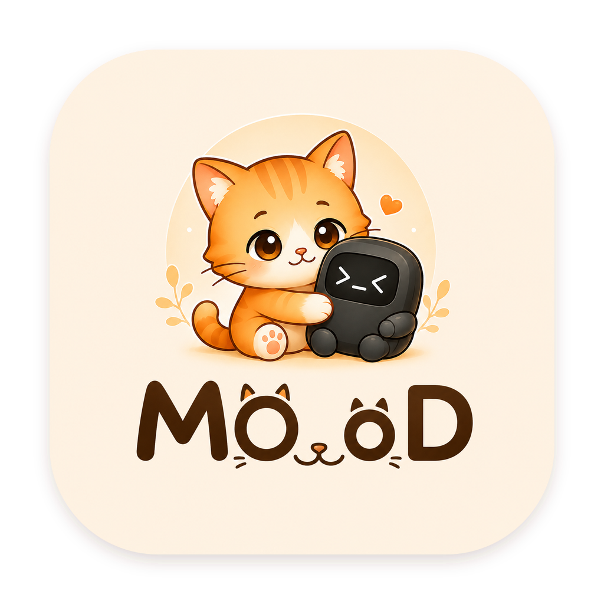
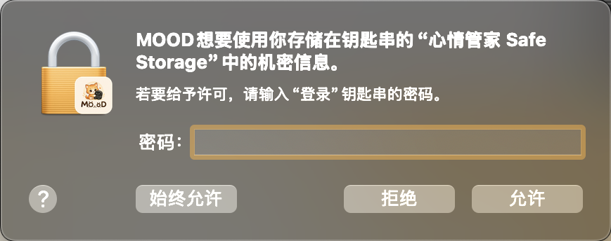
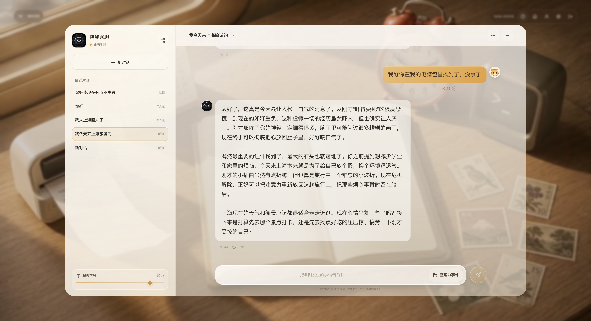
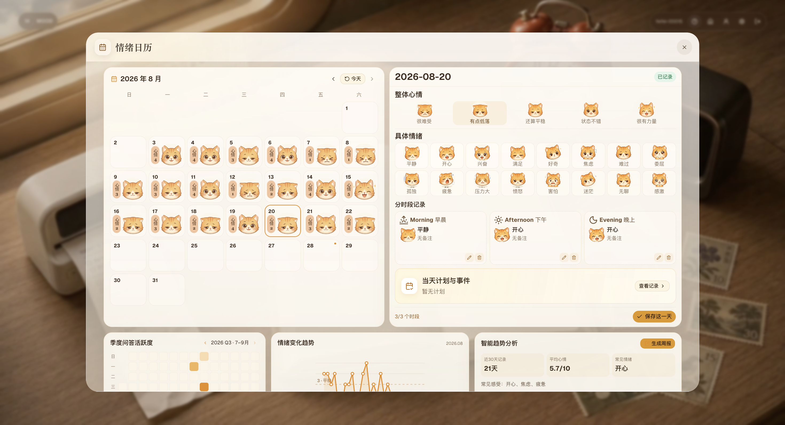
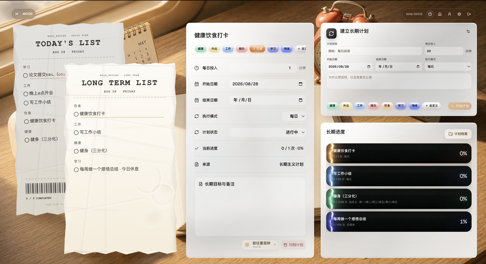
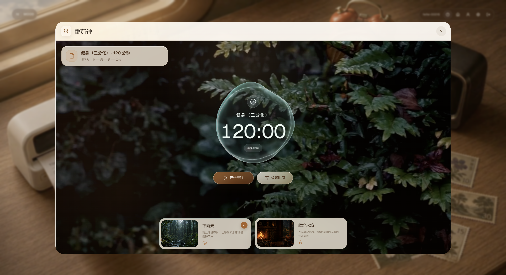
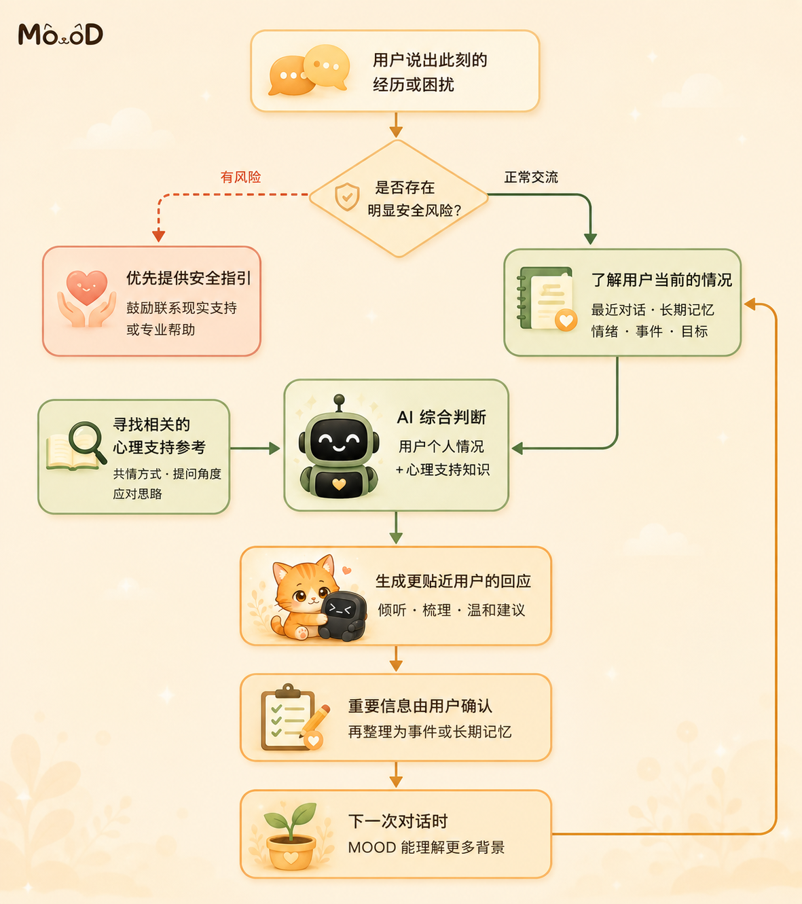

  
  <h1>MOOD</h1>
  
<strong>A place to record your life—and help AI understand you over time.</strong>

  
A desktop app that connects conversations, emotions, experiences, plans, and everyday memories.

  
This introduction is available in: <a href="README.md">简体中文</a> · <strong>English</strong>

  
<code>v1.0.0 Beta</code> · Windows x64 · macOS Apple Silicon

  
<a href="https://github.com/feifei-00015/MOOD/releases/download/v1.0.0-beta/MOOD-1.0.0-Beta-x64-Setup.exe">Download for Windows</a> · <a href="https://github.com/feifei-00015/MOOD/releases/download/v1.0.0-beta/MOOD-1.0.0-arm64.dmg">Download for macOS</a> · <a href="https://github.com/feifei-00015/MOOD/releases/tag/v1.0.0-beta">View this release</a>

## Quick start

MOOD `v1.0.0 Beta` is currently available for Windows and macOS:

| Platform | Architecture | Installer size | Download |
| --- | --- | ---: | --- |
| Windows | x64 | About 379 MB | [Download the `.exe` installer](https://github.com/feifei-00015/MOOD/releases/download/v1.0.0-beta/MOOD-1.0.0-Beta-x64-Setup.exe) |
| macOS | Apple Silicon / arm64 | About 404 MB | [Download the `.dmg` package](https://github.com/feifei-00015/MOOD/releases/download/v1.0.0-beta/MOOD-1.0.0-arm64.dmg) |
| Linux | Not available yet | — | — |

### Windows

1. Download `MOOD-1.0.0-Beta-x64-Setup.exe`.
2. Run the installer and follow the prompts.
3. Open MOOD from the Start menu or desktop.

If Windows displays a security warning, first confirm that the file came from this repository's Releases page before deciding whether to continue.

### macOS

1. Download `MOOD-1.0.0-arm64.dmg`.
2. Open the DMG and install MOOD in Applications.
3. Open MOOD from Applications.

The current macOS beta package has not yet been signed with an Apple Developer certificate. If macOS blocks the first launch, confirm that the package came from this repository's Releases page, then use **System Settings → Privacy & Security → Open Anyway**.

On first launch, macOS may also ask MOOD for access to **Mood Butler Safe Storage** in Keychain:

MOOD creates local encryption keys for your records, AI configuration, and stamp photos, then uses macOS Keychain to protect those keys. When the app needs to encrypt or decrypt local data, macOS asks whether MOOD may read its own secure-storage entry. The password you enter is your Mac login password and is handled entirely by macOS. MOOD does not receive it, and this permission does not give MOOD access to unrelated passwords in your Keychain.

### First-time setup

After creating an account and signing in, open **Settings → AI Model**. Enter the API Base URL, model name, and API key for a compatible AI service, then select **Test Connection**. Obtain these details from the provider you choose, and never share your API key with anyone else.

MOOD is still in beta. Exporting a backup of important records regularly—and before upgrading—is recommended.

## Why is the installer fairly large?

MOOD bundles the desktop runtime, its local AI/RAG service, and a ready-to-use index of supportive-conversation cases. The initial download is larger, but you do not need to install Python, a database, or a separate runtime yourself.

One of the largest parts is the RAG index, which contains more than 30,000 vector records. On first launch, its roughly 155 MB archive is unpacked into a working index of about 324 MB. This is one shared base resource bundled with the app; adding one of your own records does not create another copy of the whole database.

For reference, the current macOS app itself is about 622 MB, mostly made up of:

| Main component | Approx. size | What it is for |
| --- | ---: | --- |
| Electron / Chromium desktop runtime | 231 MB | Runs the same desktop interface on Windows and macOS |
| Compressed base RAG index | 155 MB | More than 30,000 prebuilt Embedding records |
| Web interface and app resources | 134 MB | MOOD's screens, features, and static assets |
| Local AI / RAG service | 71 MB | Retrieval, context preparation, and service communication |
| Source supportive-conversation cases | 24 MB | Text references used by the RAG system |

First launch also creates the roughly 324 MB working RAG index, so we recommend keeping at least **1–1.2 GB** of disk space free. Final usage varies slightly by operating system and installation method. This is disk usage—not the amount of memory MOOD constantly consumes while running.

The data that belongs specifically to you grows much more slowly:

- Conversations, events, emotions, and plans are mostly text and usually remain at MB-scale even with long-term use.
- Personal long-term memory adds a small search entry for each confirmed item. Even thousands of items remain far smaller than the bundled 30,000+ record base index.
- Stamp photos are the part most likely to grow noticeably. Each photo is cropped to 800×1000 WebP and encrypted locally; the exact size depends on the image, but it is usually a few hundred KB per photo.

## What is MOOD trying to do?

Life leaves us with all kinds of moments: an argument, a low day, a sudden thought, or the relief of finally finishing something we had put off for weeks. Those moments often end up scattered across chats, calendars, and to-do lists, then become difficult to find again.

MOOD is designed to connect those pieces. You can record what is happening, receive gentle everyday emotional support when you need it, and turn meaningful experiences into events, stories, and actions. Records you confirm can become long-term context, so future conversations do not have to begin from zero.

In the longer term, that context should not belong to one model or one app. MOOD can already export your profile, conversations, events, emotions, and plans as JSON. Our future goal is to turn selected, user-approved parts of that archive into portable personal context that you can share with other agents.

_The diagram is in Chinese because MOOD's current interface is Chinese. It shows the path from recording yourself to building user-owned context that can support MOOD today and other agents in the future. All static README images are uploaded at their original resolution; select one to view the full-size image._

## How do the features work together?

MOOD is not a chat box, a calendar, and a to-do list placed next to one another. Each part can naturally lead into the next.

### 1. Begin with a conversation

Start by sharing what happened today—or simply say, “I am having a difficult moment.” MOOD first tries to understand whether you want to be heard, make sense of the situation, or take one small next step.

When a conversation contains an experience worth keeping, MOOD asks whether you want to organize it. It does not quietly turn an interpretation into a fact.

### 2. Turn meaningful experiences into stories

Once you confirm an event, its people, time, facts, thoughts, emotions, and possible needs can stay together for later review.

Related events gradually form a story. Instead of searching through isolated chat messages, you can return to a chapter of life you actually lived through.

### 3. Notice how your emotions change

The emotion calendar places mood, stress, sleep, and triggers on a timeline. It is not there to grade you. It helps you notice what has been affecting you, when you tend to feel drained, and which patterns may be changing.

### 4. Turn reflection into action

After talking something through, a next step can become a daily or long-term plan. A plan can then move into the focus timer and become time you have actually set aside.

MOOD also keeps the outcome and your feedback. When a similar situation comes up later, it can remember not only what you planned to do, but which approaches genuinely worked for you.

### 5. Keep the moments worth celebrating

Life is not only a list of problems to solve. Finishing something, visiting a place, or noticing a moment you want to remember can become a stamp—a small record and a small reward for showing up in your own life.

> Conversation → Events and stories → Emotions → Plans → Focus → Feedback → Better context next time

## How does MOOD shape a response?

From a user's perspective, the process is simple. MOOD first checks for an immediate safety concern. Within the permissions you choose, it can then consider recent conversations, confirmed experiences, emotions, and goals, alongside relevant examples of supportive conversations, before composing a response that better fits the moment.

If a message suggests an immediate risk to someone's safety, MOOD prioritizes safety guidance and encourages the user to contact a trusted person, local emergency services, or professional support instead of continuing with an ordinary chat.

An older story can only be offered as a possible connection. Important details require your confirmation before they become an event or long-term memory, and you can edit, disable, or delete them at any time.

## Your records belong to you

The current version can export a compact JSON file containing your profile and preferences, useful conversations and summaries, confirmed events and stories, emotion records, tasks, and long-term plans.

The export does not include stamp images, system logs, account credentials, or AI configuration. Treat the file as private personal data and store it carefully.

**Available today:** you can export these structured records, giving you a copy you control when changing devices or organizing your personal archive.

**Our future direction:** generate a smaller, selectable, user-approved Agent Context Pack from that archive. You could share it with a learning, work, health, or general-purpose agent so a new AI can understand your background and preferences more quickly. Automatic generation and importing of this context pack is a future goal, not a feature claimed by the current release.

## Privacy, safety, and boundaries

- You can separately control long-term memory, historical context, event suggestions, and personal-memory retrieval.
- Important details found in a conversation require your confirmation before they are treated as facts.
- Generating an AI response sends the necessary conversation and context to the AI provider you configure. Please review that provider's privacy policy as well.
- Important information is stored with encryption. You can export your archive or permanently delete your account and its associated data.
- MOOD provides everyday emotional support. It does not diagnose conditions, recommend medication, or replace therapy, medical care, or emergency assistance.

## Feedback

If you encounter a problem or have an idea for MOOD, please tell us through [GitHub Issues](https://github.com/feifei-00015/MOOD/issues). Including what you were doing and what you saw will help us investigate.

  
<strong>Models will change. You should not have to introduce yourself from scratch every time.</strong>

